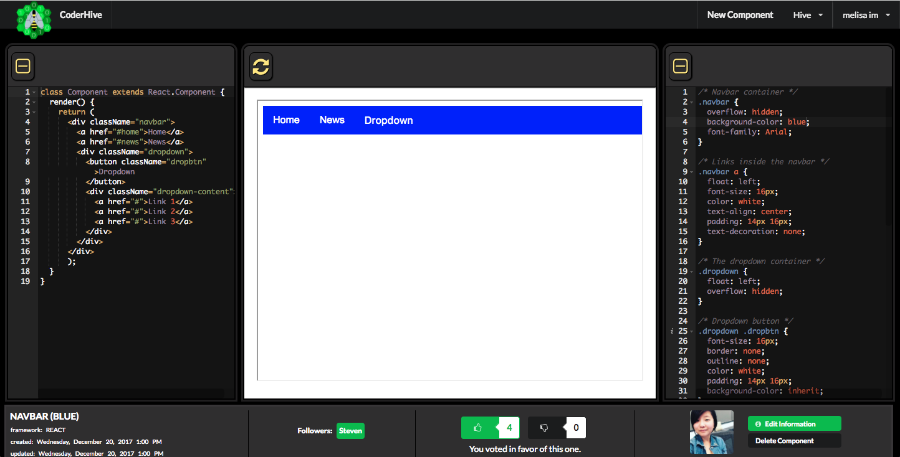

# Coder Hive

## Overview

Coder Hive was the brainchild of Chuck Hagy and Melisa Im to empower developers to collaborate and learn JavaScript frameworks. At this time, the platform only supports React/JSX, but we aspire to extend the app to also support Vue and Angular. They named the application Coder Hive due to the collaborative nature of bees and most importantly because bees are neat.

Would you like to work on our open source project? Join the hive as a contributor.

Click to watch video:

## Technologies

### Front-End
 
The Coder Hive front-end provides a sleek interface for web developers to create and share their React web components without having to set up their own custom React environment. It ties smoothly into the app’s GraphQL back-end to efficiently persist data and ensure authorized user access.

- React framework powers reusable, component based UIs. Clear separation of concerns for unit testing
- Apollo-Client is a fully-featured caching GraphQL client that completely replaces Redux for state management
- The Ace Editor components enable the linting and formatting of CSS and JSX code input by Coder Hive users
- AWS SDK allows data streaming to an S3 bucket in order to store and later read unique resources in the hive

### Back-End

The Coder Hive back-end makes it fast and easy for users to create accounts, render React components and collaborate with other users. All in a safe and secure environment that works seamlessly with our client-side rendered React app.

- GraphQL Intuitive API design that allows the client to access and modify data without the limits of RESTful endpoints
- PostgresQL database that makes  it easy to access intricate relationships between users, components, and social activity
- Express.js framework that simplifies tasks like authentication, authorization and routing within Node.js
- Node.js back-end that enables users to save, share and comment on each other’s concepts - but only when authorized